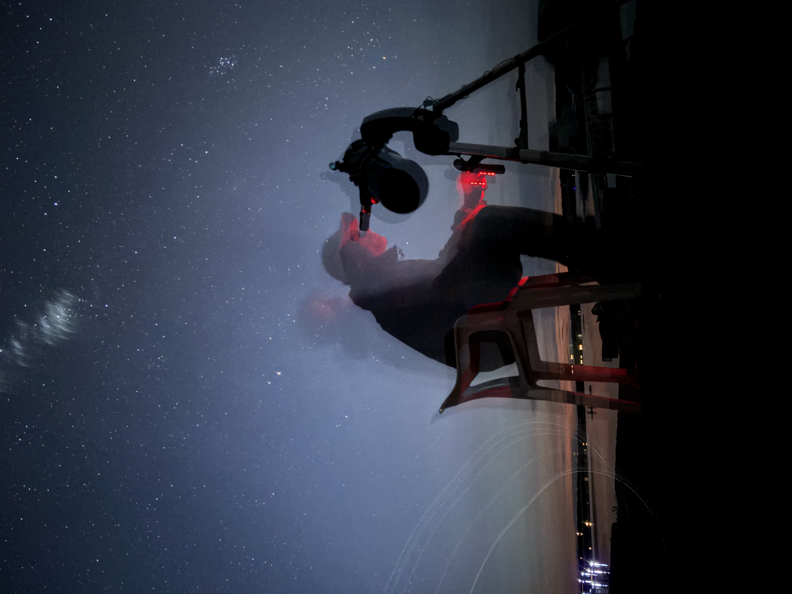
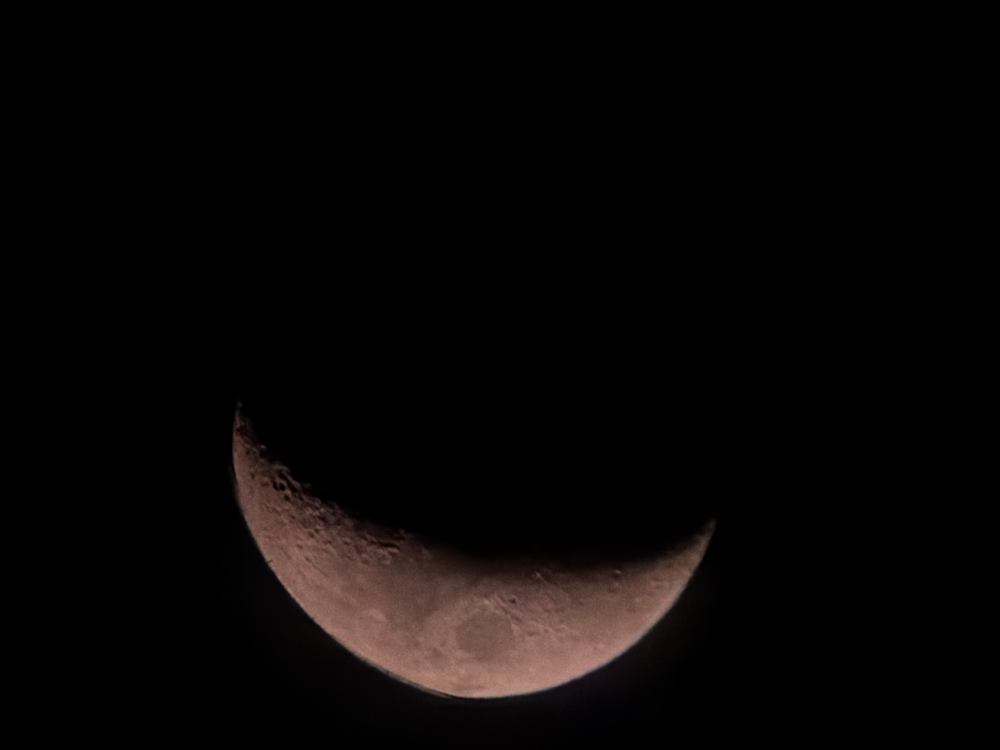
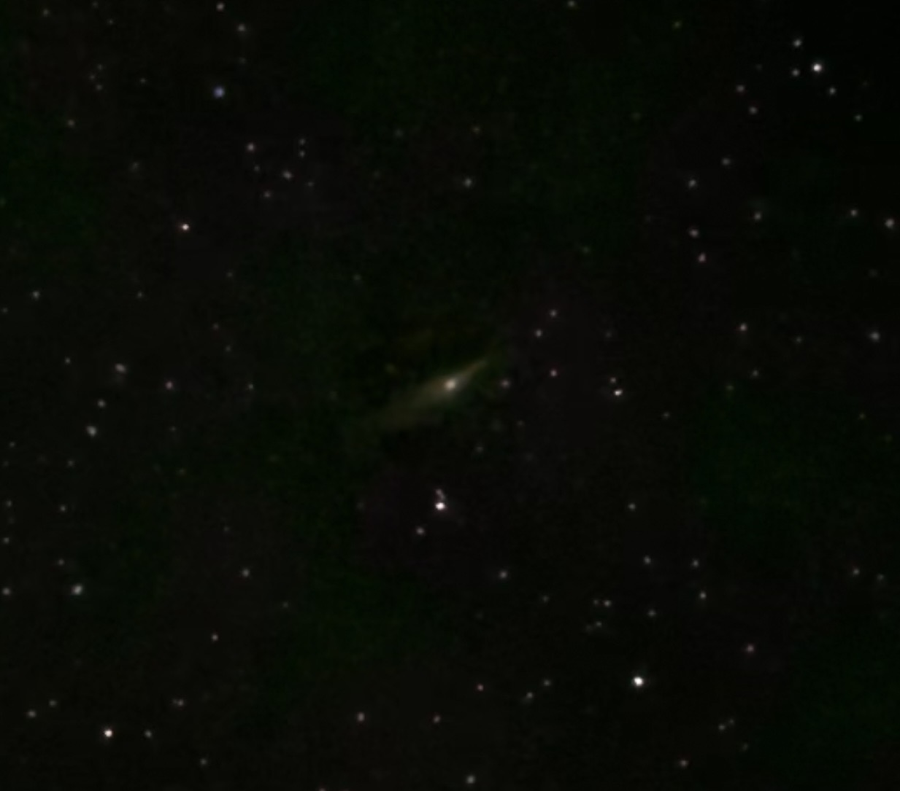
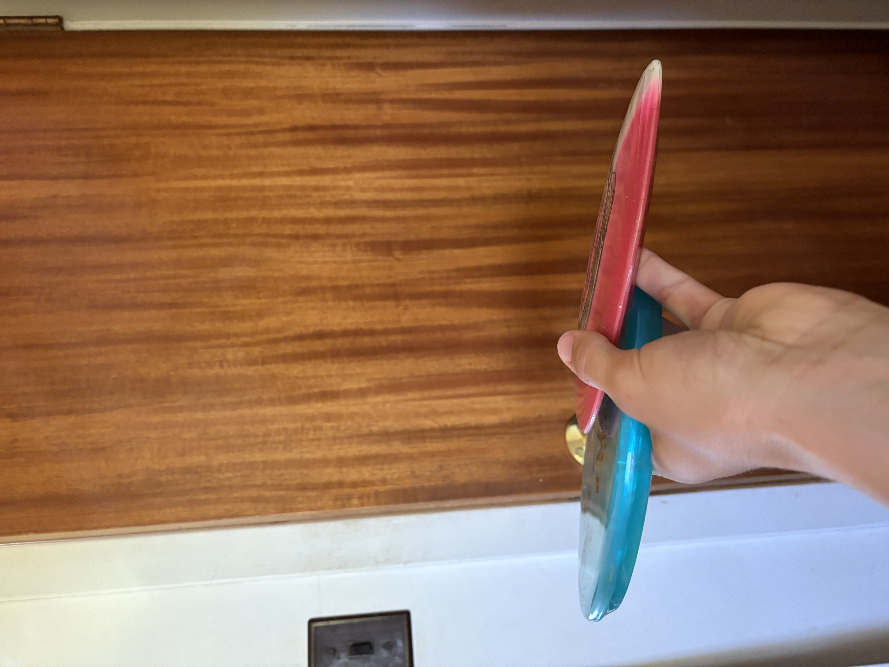
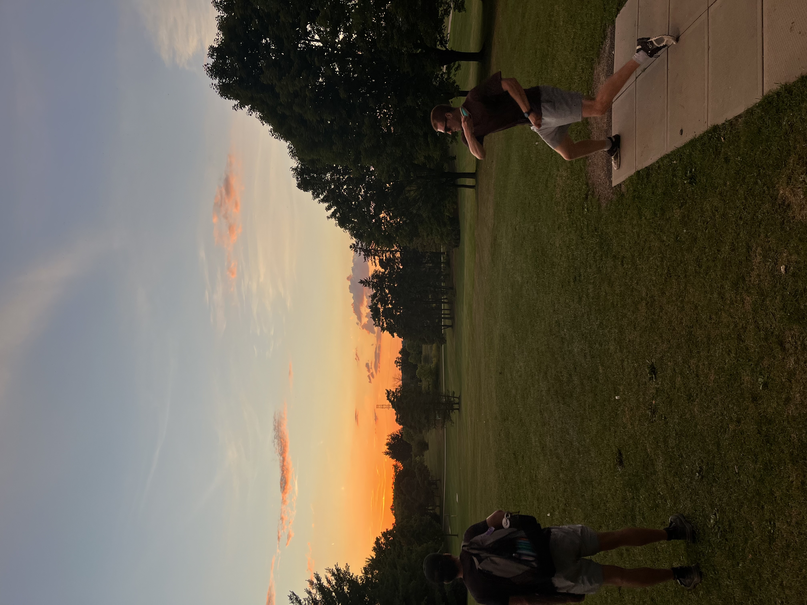

# Hobbies

---

## Amateur Astronomy

  
  
  

I had a Celestron AstroMaster 130 5 inch reflector telescope gifted to me by my great uncle. It has taken a lot of troubleshooting, but after a few months I figured out how to properly collimate the scope, and align the GoTo feature of the telescope (though I haven't got the alignment perfect yet). 

I love going to Tobermory where the light pollution is very low and seeing what I can find. At my most recent outing, I got a great view of saturn, some binary stars, and the andromeda galaxy. It's so peaceful to go out late at night and just look at the stars. 

I have a long term goal to try to see all of the Messier objects. Though before I even get close to that goal I need to continue refining my telescope and figuring out how to use tracking software. My great uncle also gave me wavelength filters that I want to use to see features of planets like the ice caps on Mars or more details on Jupiter.

---

## Disc Golf

  
  
  

I started playing disc golf about 2 years ago. UWaterloo has a course very close to my student house, so my roommates and I play this course very consistently. As we have gotten better, we have started playing at more courses in the area and last year me and my roommate joined our local disc golf club.

For people who don't know what disc golf is, it has the same rules as golf except instead of a bag of clubs, you have a bag of around 15 discs. The discs all fly differently which allows you to shape your shots. To help visualize this, there's a photo above of me holding one of my drivers beside one of my approach discs (you can see they look very different). Disc golf courses are often in the woods, where instead of avoiding bunkers, you are trying to squeeze your disc through tight wooded fairways.

This sport has been great stress relief for me over these busy 2 years of university. The sport has also connected me with a great community of disc golf enthusiasts in Waterloo region.

