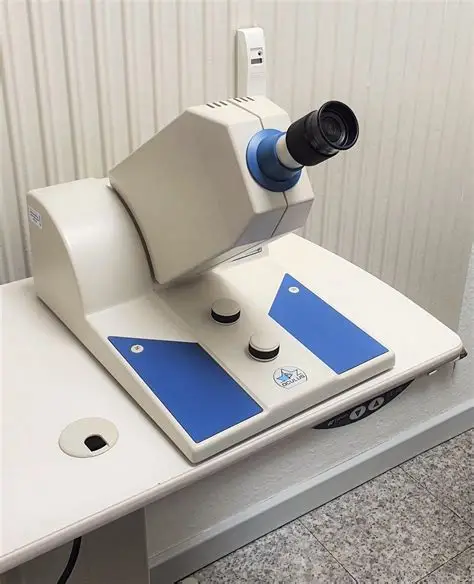

# Professional Experience

---

## Research Assistant — School of Optometry & Vision Science  
**University of Waterloo | May – Sep 2026**

  

Research assistant for the Hovis Lab at the University of Waterloo. Assisting in a study examining and developing methods to test for colour vision defects intended for pilots in the Royal Canadian Air Force (RCAF).

Most of my work involves data analysis using Python, R, and Excel. I have built large-scale machine learning models to separate normal colour vision individuals from those with colour vision deficiencies. Over this co-op, I worked extensively with PCA, Gaussian Mixture Models, Logistic Regression, Mahalanobis distance models, and a whole lot of data manipulation with Pandas, plus visualization with Plotly and Matplotlib.

I also presented my work to members of Defence Research and Development Canada. There has been a lot of trial and error which has really put my coding skills to the test, and I am incredibly grateful for this opportunity.

---

## Research Assistant — Wheat Breeding & Genetics  
**University of Guelph Ridgetown Campus | May – Aug 2025**

  
  
  

Research assistant for Dr. Ljiljana Tamburic-Ilincic’s group at the University of Guelph Ridgetown Campus. Assisted in a winter wheat breeding study aimed at developing strains resistant to Fusarium Head Blight (FHB) while maintaining ideal agronomic traits such as yield and height.

This co-op pushed me out of my comfort zone as I moved to a small town outside Chatham-Kent for the summer. The study had many moving parts, so it wasn’t unusual to start the day in the lab making *Fusarium graminearum* inoculum and end it at a remote trial plot collecting agronomic and disease-related data.

After harvest, I developed a Python model to analyze months of collected data. This model helped identify strains that balanced agronomic traits with disease resistance for potential germplasm development or commercialization. The model performed well, and I wrote a report on the results that my supervisor was very happy with.

I gained a deep appreciation for agricultural science and the complexity behind breeding studies.

---

## QA Student / Medical Physics Technician  
**WRHN Midtown Cancer Centre | Sep – Dec 2024**

  

Medical Physics Technician for the Medical Physics department at WRHN Midtown Cancer Centre (formerly Grand River Regional Cancer Centre).

This co-op revolved around LINACs — linear accelerator machines used in radiation oncology to deliver high‑energy radiation to cancer cells. One of my duties was performing quality assurance on these machines every night after clinical hours. These machines were a joy to work with and are some of the most beautifully engineered systems I’ve ever encountered.

The experiments I performed were precise and fascinating, ranging from testing calibration of LINAC movement to measuring dose delivery accuracy (how much radiation is delivered and how concentrated it is).

The Medical Physics department at WRHN had some of the most brilliant people I’ve ever met, including Dr. Johnson Darko and Dr. Ernest Osei, my main supervisors. I conducted two projects during this co-op:

- **Esophageal cancer dosimetry study** — analyzing how a more advanced treatment bed (with pitch/roll degrees of freedom) affects dose distribution.  
- **Brain cancer stereotactic radiosurgery study** — examining how increased radiation margins impact dosimetry.

Both projects involved querying and analyzing large clinical datasets using SQL and Python, and using specialized medical physics software to simulate dosimetry changes.

I am deeply grateful for the mentorship I received — it changed the way I approach science and problem‑solving.

