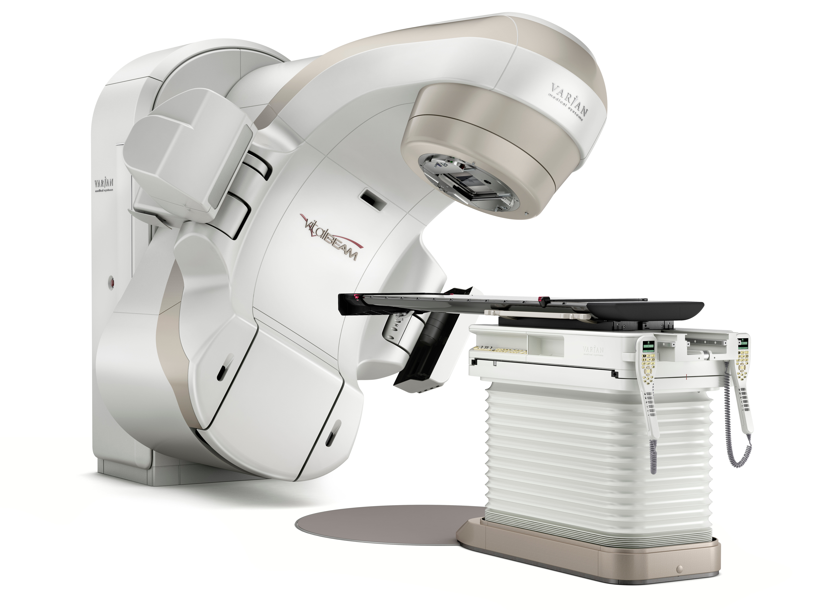

# QA Student / Medical Physics Technician | Waterloo Region Health Network (WRHN) Midtown Cancer Centre | Sep - Dec 2024

  

Medical Physics Technician for the Medical Physics department at WRHN Midtown Cancer Centre (formerly Grand River Regional Cancer Centre). 

This co-op revolved around LINACS which are linear accelerator machines used in radiation oncology to blast cancer cells with focused high energy radiation. One of my duties was to perform quality assurance on these machines every night once the clinical day was over. These machines were a true treat to work with and by far the most beautifully engineered things I have ever got the priviledge of working with. The experiments that I performed were very precise and interesting to conduct. These experiments would range from testing the calibration of the movement of the LINACs to measuring the calibration of the dose delivery (how much radiation is being delivered and how concentrated the radiation is). 

The Medical physics department at WRHN had some of the most brilliant people I have ever met. Among them were Dr. Johnson Darko and Dr. Ernest Osei who were my main supervisors. I conducted two seperate projects over my 4 months at this job. The first study looked at how the use of a more advanced bed that could pitch and roll, giving the machine more degrees of freedom could impact the dosimetry for esophageal cancer treatment. The second study looked at how dosimetry is impacted when radiation margins are increased for brain cancer sterotactic radiosurgery. Both of these studies involved working with a large clinical database, querying and analyzing large amounts of patient data with SQL and Python. I also used some very cool medical physics software to simulate how the dosimetry changes when the radiation margins are increased.

I am so grateful that I got the opportunity to learn from such talented scientists. The people that mentored me throughout this co-op changed the way that I approach the world.
