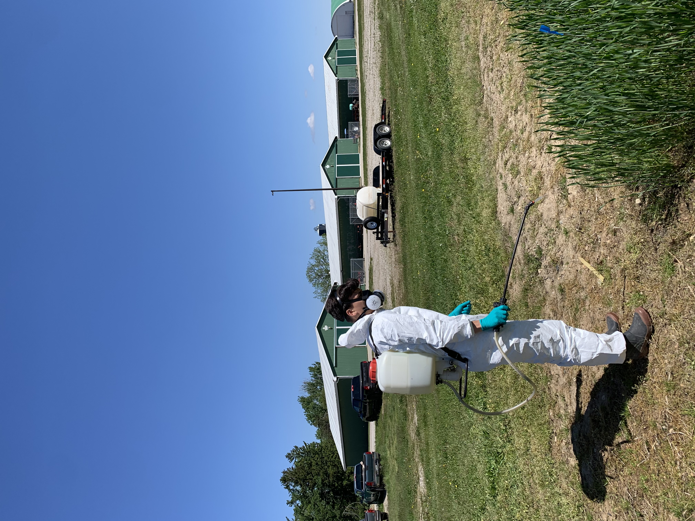
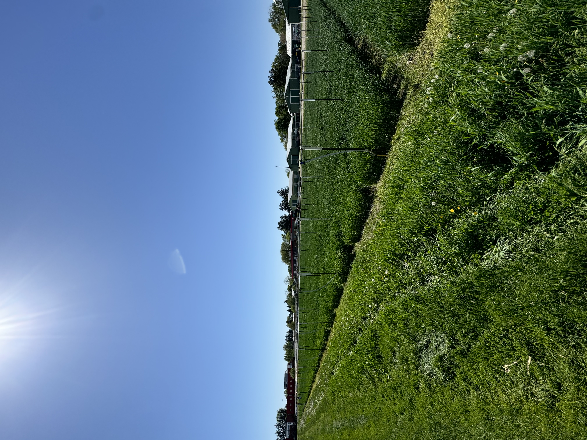
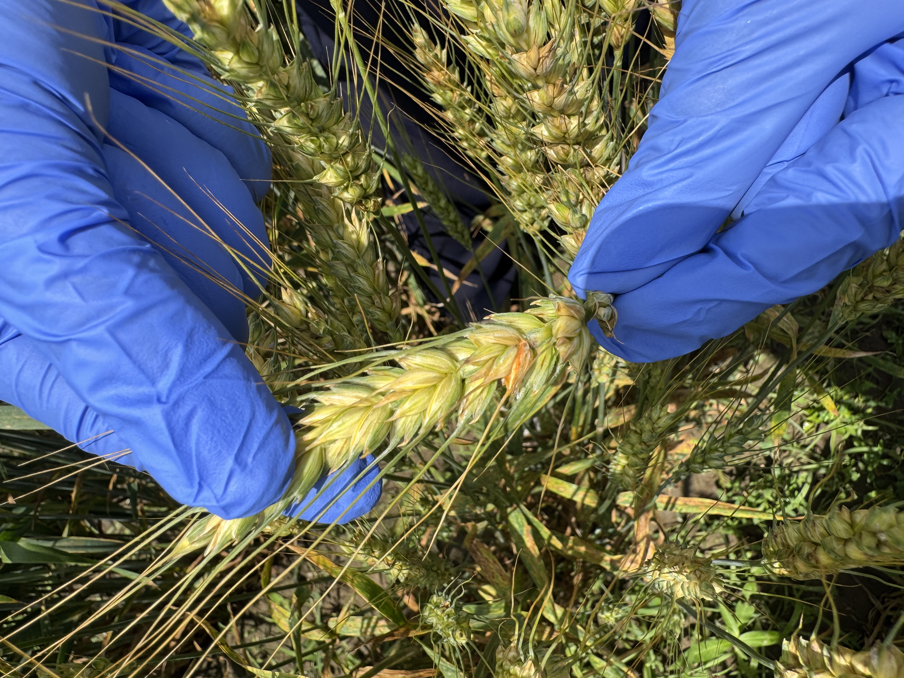

# Research Assistant | Wheat Breeding and Genetics, University of Guelph Ridgetown Campus | May - Aug 2025

  
  
  

Research assistant for Dr. Ljiljana Tamburic-Ilincic's group at University of Guelph Ridgetown Campus. Assisted in winter wheat breeding study with the goal of developing strains with resistance to Fusarium Head Blight (FHB) while also having ideal agronomic traits such as yield and height.

This co-op took me out of my comfort zone as I had to move away from home and live in a small town just outside of Chatham-Kent for the summer. I felt like I was learning something new every day of this co-op. The study had many moving parts so it wasn't irregular to start your day in the lab making Fusarium graminereum inoculum and end it in the middle of nowhere at a remote trial plot, collecting data about agronomic and disease related traits for the different strains. Once the wheat had been harvested, I got to work developing a model in Python that analyzed all of the data we had been collecting over the previous months. This model assisted in the selection of the ideal strains that balanced agronomic traits with disease resistance for potential germplasm development or comercialization. The model ended up working pretty well, and I wrote a report on the results I got which my supervisor was quite happy with.

I learned so much about a field I knew almost nothing about going in, and I have a newfound appreciation for agricultural science and all the work that goes into many of these studies.
